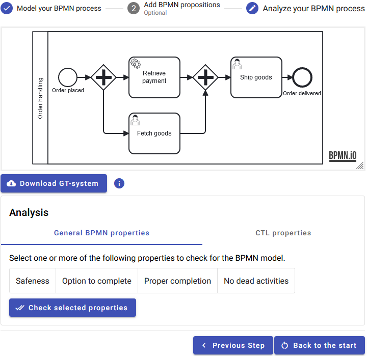

# LMCS-2024
This repository contains the sources for our paper submitted to a special issue of [LMCS](https://lmcs.episciences.org/) together with additional information below.

This paper is an extended version of a paper published at [ICSME-2023](https://doi.org/10.1007/978-3-031-36709-0_11), which received the [**_★Best Software Science Paper Award★_**](https://raw.githubusercontent.com/timKraeuter/ICGT-2023/main/BestPaperICGT2023.pdf).

The corresponding BPMN Analyzer tool is described [below](https://github.com/timKraeuter/LMCS_2024#bpmn-analyzer-tool).
Other additional artifacts of this paper are also listed below following the section structure of the paper.

# Model checking BPMN

## Custom properties

Show propositions in BPMN and as groove graph conditions first.

The GT system for the examples can be found [here](/artifacts/orderHandling.gps.zip).
After downloading and unzipping you can open it in [Groove](https://groove.ewi.utwente.nl/) to explore the state space in detail and run model checking.

# Implementation

## BPMN Analyzer tool

The BPMN Analyzer is available
online [here](https://bpmnanalyzer.whitefield-c9fed487.northeurope.azurecontainerapps.io).

The source code of the BPMN Analyzer is available [here](https://github.com/timKraeuter/Rewrite_Rule_Generation) and instructions how to run it locally on your machine can be found [here](https://github.com/timKraeuter/Rewrite_Rule_Generation/blob/master/server/README.md).

### Published libraries for reuse
The BPMN Analyzer is build using different libraries we have created.
These libraries are also useful in other contexts and have thus been shared independently of the tool:

1. An editor library for defining a snapshot/state of a running BPMN process using tokens and process snapshots: [**_token-bpmn_** (npm)](https://www.npmjs.com/package/bpmn-token)
2. An extension of the BPMN metamodel, adding process snapshots and tokens, i.e., our BPMN execution metamodel: [**_token-bpmn-moddle_** (npm)](https://www.npmjs.com/package/token-bpmn-moddle)
3. A library to generate graph transformations systems currently implemented for Groove: [**_graph rule generation_** (Maven central)](tbd) 

### Test suite

The [wiki](https://github.com/timKraeuter/Rewrite_Rule_Generation/wiki) describes our [comprehensive test suite](https://github.com/timKraeuter/Rewrite_Rule_Generation/wiki/Test-Suite) to test our coverage of BPMN features. 

Feel free to contact me for further information.
