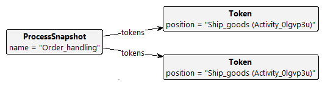
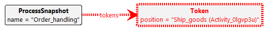
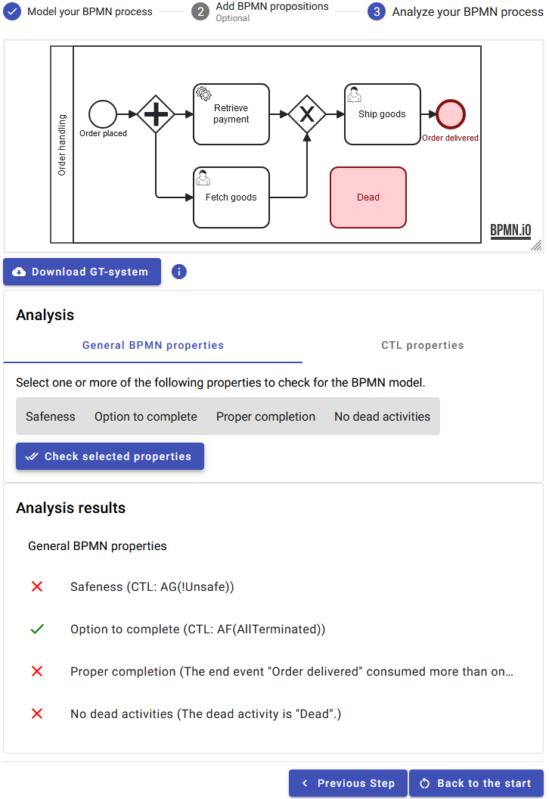

# LMCS-2024
This repository contains the sources for [our article](./paper.pdf) published in [Logical Methods in Computer Science (LMCS)](https://lmcs.episciences.org/) and additional artifacts below.

This article is an extended version of a paper published at [ICGT-2023](https://doi.org/10.1007/978-3-031-36709-0_11), which received the [**_★ Best Software Science Paper Award ★_**](https://raw.githubusercontent.com/timKraeuter/ICGT-2023/main/BestPaperICGT2023.pdf).

The corresponding BPMN Analyzer tool is described [below](https://github.com/timKraeuter/LMCS_2024#bpmn-analyzer-tool).
Other additional artifacts of this article are also listed below, following the section structure of the article.

# Tool Demonstration
A demonstration of our tool is available on [YouTube](https://youtu.be/MxXbNUl6IjE).

# BPMN Semantics formalization

Our [wiki](https://github.com/timKraeuter/Rewrite_Rule_Generation/wiki) describes the BPMN formalization in more detail, accompanied by many examples of BPMN models and graph transformation rule examples.

## Process termination

The following graph condition in Groove implements _process termination_:

The rule is called **Terminate** and is automatically added during graph grammar generation.
The dashed red borders mark parts of negative application conditions, grey parts remain untouched,
blue parts are deleted, and green parts are added.

# Model Checking BPMN

## General BPMN properties

General BPMN properties can be checked in the [web-based tool](https://bpmnanalyzer.whitefield-c9fed487.northeurope.azurecontainerapps.io), which runs Groove in the cloud (no local installation needed).

The [BPMN Analyzer tool](https://github.com/timKraeuter/LMCS_2024#bpmn-analyzer-tool) subsection shows a screenshot with an example verification result.

### No dead activities

To check this property, we generate the state space of the GT system and analyze it to see if each activity has been executed at least once.
If this property is not fulfilled, the activity is highlighted in red in the BPMN model.
See, for example, the [BPMN Analyzer tool](https://github.com/timKraeuter/LMCS_2024#bpmn-analyzer-tool) subsection.

## Custom properties

The **"shipGoodsTwice"** proposition results in the following graph condition in Groove:

You can check that this state is never reached using the CTL proposition `AG(!shipGoodsTwice)`.

The **"noShipment"** proposition results in the following graph condition in Groove:

You can check that a shipment always occurs using the CTL proposition `!AG(noShipment)`.

The GT systems for the examples can be found [here](/artifacts/customPropositions/) ending in `.gps`.
After downloading and unzipping, you can each Gt system in [Groove](https://groove.ewi.utwente.nl/) to explore the state space in detail and run model checking.

# BPMN Analyzer tool

The BPMN Analyzer is available
online [here](https://bpmnanalyzer.whitefield-c9fed487.northeurope.azurecontainerapps.io).
The [wiki](https://github.com/timKraeuter/Rewrite_Rule_Generation/wiki) describes our [comprehensive test suite](https://github.com/timKraeuter/Rewrite_Rule_Generation/wiki/Test-Suite) to test our coverage of BPMN features. 

The source code of the BPMN Analyzer is available [here](https://github.com/timKraeuter/Rewrite_Rule_Generation), and instructions how to run it locally on your machine can be found [here](https://github.com/timKraeuter/Rewrite_Rule_Generation/blob/master/server/README.md).

## Reusable libraries
The BPMN Analyzer is built using different libraries we have created.
These libraries are also helpful in other contexts and have thus been shared independently of the tool:

1. An editor library for defining a snapshot/state of a running BPMN process using tokens and process snapshots: [**_token-bpmn_** (npm)](https://www.npmjs.com/package/bpmn-token)
2. An extension of the BPMN metamodel, the Token Editor, adding process snapshots and tokens: [**_token-bpmn-moddle_** (npm)](https://www.npmjs.com/package/token-bpmn-moddle)
3. A library to generate graph transformation systems currently implemented for Groove: [**_graph rule generation_** (Maven central)](https://mvnrepository.com/artifact/io.github.timKraeuter/graph-rule-generation)

## Performance testing

The performance tests are described [here](https://github.com/timKraeuter/LMCS-2024/tree/main/artifacts/experiments#performance).

## Scalability testing

The scalability tests are described [here](https://github.com/timKraeuter/LMCS-2024/tree/main/artifacts/experiments#scalability).
