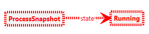

# ICGT-2023

This repository contains the sources for our [paper](https://doi.org/10.1007/978-3-031-36709-0_11) ([pre-print](./paper.pdf)) published at [ICGT-2023](https://conf.researchr.org/home/icgt-2023) together with additional information below.

The corresponding BPMN Analyzer tool is available [here](https://bpmnanalyzer.whitefield-c9fed487.northeurope.azurecontainerapps.io).

[**★ The paper received the _Best Software Science Paper Award_. ★**](https://raw.githubusercontent.com/timKraeuter/ICGT-2023/main/BestPaperICGT2023.pdf)

## BPMN Semantics formalization

Our [wiki](https://github.com/timKraeuter/Rewrite_Rule_Generation/wiki) describes the BPMN formalization in more detail, accompanied by many examples of BPMN models and graph transformation rule examples.

### Process termination

Process termination is implemented by the following graph transformation rule in Groove:

The rule is called **Terminate** and is automatically added during graph grammar generation.
The dashed red borders mark parts of negative application conditions, grey parts remain untouched,
blue parts are deleted, and green parts are added.

## Model Checking BPMN

### General BPMN properties

General BPMN properties can be checked in the [web-based tool](https://bpmnanalyzer.whitefield-c9fed487.northeurope.azurecontainerapps.io), which runs Groove in the cloud (no local installation needed).

The [Implementation](https://github.com/timKraeuter/ICGT-2023#implementation) section shows a screenshot with an example verification result.

#### Safeness

The atomic property **Unsafe** is implemented by the following graph condition in Groove:

The property matches whenever two tokens of one process snapshot have the same position (but have
different identities).

#### Option to complete

The atomic property **AllTerminated** is implemented by the following graph condition in Groove:

The property matches whenever there is no process snapshot in the state running. All process
snapshots are terminated, i.e., have no tokens.

### Custom properties

Defining atomic propositions directly in BPMN Analyzer by distributing tokens over the process model has
not been implemented yet.
Thus, for the time being, custom properties have to be checked in Groove by defining atomic propositions there.

## Implementation

### BPMN Analyzer tool

The BPMN Analyzer is available
online [here](https://bpmnanalyzer.whitefield-c9fed487.northeurope.azurecontainerapps.io).

The source code of the BPMN Analyzer is
available [here](https://github.com/timKraeuter/Rewrite_Rule_Generation) and instructions
how to run it locally on your machine can be
found [here](https://github.com/timKraeuter/Rewrite_Rule_Generation/blob/master/server/README.md).

### Experiments

The experiments are described [here](https://github.com/timKraeuter/ICGT-2023/tree/main/artifacts/experiment#readme).

### Test suite

The [wiki](https://github.com/timKraeuter/Rewrite_Rule_Generation/wiki) describes our [comprehensive test suite](https://github.com/timKraeuter/Rewrite_Rule_Generation/wiki/Test-Suite) to test our coverage of BPMN features. 

Feel free to contact me for further information.

## Discussion

The instructions to run the experiments can be found [here](https://github.com/timKraeuter/ICGT-2023/tree/main/artifacts/experiment#readme).
